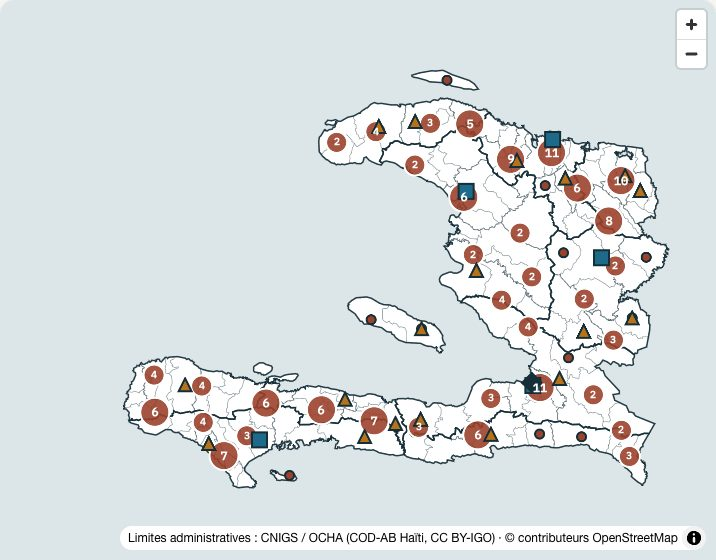
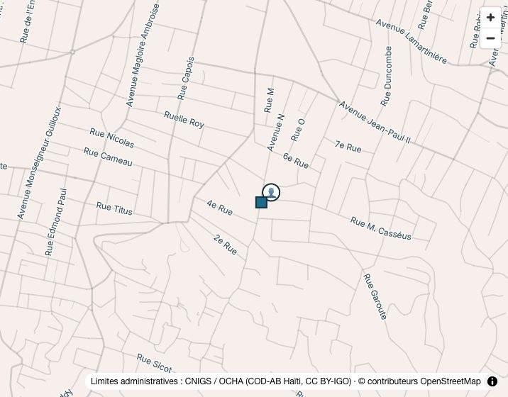
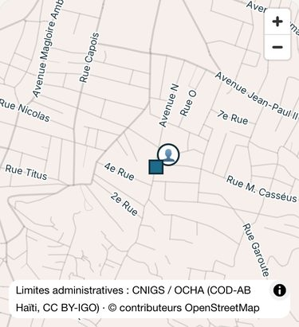

# Livraison : le fond de rues de la carte judiciaire (option A)

9 octobre 2026. Spécification : `docs/prompt-production-notaires-et-fond-de-rues.md`, partie 2.
Code commité en local, **pas poussé** : le fichier de tuiles et les polices partiront avec le
prochain déploiement, sur instruction de Me Vaval.

## Ce qui est fait

Quand on zoome sur la carte judiciaire, on voit **les routes à partir du zoom 11** et **leurs
noms à partir du zoom 14**. Les noms s'écrivent dans la police du site (Inter), sous les tribunaux
et les 👤.

**Tout est servi par agora.ht** : aucune origine externe, la CSP `connect-src 'self'` est
inchangée. Mesuré sur la page zoomée : **0 requête vers une autre origine**.

| élément | emplacement | taille |
|---|---|---|
| routes d'Haïti (OpenStreetMap), PMTiles, zooms 11-15 | `public/maps/hti/routes-hti.pmtiles` | **8,4 Mo** (budget 15 Mo) |
| source, date, empreintes, comptes | `public/maps/hti/routes-metadata.json` | — |
| glyphes Inter Regular (256 plages, 11 non vides) + licence OFL | `public/maps/fonts/Inter-Regular/` | 470 Ko |
| chaîne de fabrication, rejouable | `scripts/build-routes-haiti.py` | — |
| couches, source, glyphes, mentions (module pur, testé) | `src/lib/jurisdictions/fond-de-rues.ts` | — |
| lecteur PMTiles | dépendance `pmtiles` 4.5.0 (Protomaps), épinglée | — |

### La source

- **Extrait** : Geofabrik « Haiti and Dominican Republic » du **8 octobre 2026**.
  - 88 735 560 octets ;
  - SHA-256 `78c65f69fb99cad618a37b63c0f07b5a9aa5691113dd1ca13d0c379197128010` ;
  - stocké hors du dépôt.
- **Découpage sur Haïti seule** (union des départements COD-AB) : les tuiles vont de −74,47 à
  −71,62 de longitude, sans la République dominicaine.
- **Voies retenues** : 61 919, dont 16 186 nommées.

| classe | voies | nommées | à partir du zoom |
|---|---|---|---|
| majeure (`trunk`, `primary`) | 1 213 | 1 052 | 11 |
| secondaire (`secondary`, `tertiary`) | 3 063 | 2 154 | 11 |
| locale (`residential`, `unclassified`…) | 56 352 | 11 689 | 13 |
| service et pistes, **nommées seulement** | 1 291 | 1 291 | 13 |

**Licence** : ODbL. La mention « © contributeurs OpenStreetMap » s'affiche dans la carte et dans
la ligne « Données cartographiques ». Elle est ajoutée **séparément** de
`NEXT_PUBLIC_MAP_ATTRIBUTION` : cette variable, si elle est définie en production, ne peut plus
l'effacer (test).

## La vue d'ouverture ne change pas

Mesuré sur le banc, sur un build de production :

- à l'ouverture, **aucune tuile de rues ni aucun glyphe** n'est chargé ; seul l'en-tête du
  fichier est lu (une requête partielle) ;
- **35 étiquettes d'agrégat**, les mêmes valeurs qu'avant ;
- capture de la carte : **7 pixels** d'écart (anticrénelage) hors du bandeau d'attribution.
  Le bandeau, lui, gagne la mention OpenStreetMap.

| avant | après |
|---|---|
|  |  |

## Port-au-Prince zoomé

Les noms d'OSM s'affichent, accents compris : « Avenue Lamartinière », « Rue M. Casséus »,
« Avenue Jean-Paul II », « Rue Capois ».

| ordinateur (zoom 14) | téléphone |
|---|---|
|  |  |

## Vérifications

- **Tests** : `fond-de-rues.test.ts`, 10 tests.
  - couches et zooms minimaux ;
  - URL absolues ;
  - gabarit des glyphes aux `{` `}` intacts ;
  - mention OSM toujours présente ;
  - en-tête du fichier RÉEL (Haïti seule, zooms 11-15) ;
  - budget ;
  - métadonnées qui décrivent ce fichier (taille, SHA-256) ;
  - glyphes présents.
- `npm run typecheck`, `npm run lint`, `npx vitest run --dir src` et `npm run build:check`
  passent.
- **Requêtes partielles** (`Range`) servies en 206 par le build de production local. À revérifier
  sur agora.ht après le déploiement :
  ```bash
  curl -r 0-99 -I https://agora.ht/maps/hti/routes-hti.pmtiles
  ```

## Décidé seul

1. **Police Inter**, fabriquée à partir des deux sous-ensembles WOFF2 que le site sert déjà
   (`src/app/fonts/Inter-var-normal-latin*.woff2`). Ils sont instanciés en Regular (400), fusionnés
   (950 glyphes), puis convertis en glyphes de carte (`build_pbf_glyphs` 1.5.1). Aucune autre copie
   de la police n'a été téléchargée.
2. **Métadonnées dans un fichier à part** (`routes-metadata.json`) et non dans `metadata.json` :
   ce dernier est régénéré par `build-judicial-map-geo.py`, qui les aurait effacées.
3. **Voies de service et pistes** gardées seulement si elles ont un nom.
4. **Les 256 plages de glyphes** sont versionnées, même les 245 vides (30 octets chacune) : la carte
   ne demande jamais un fichier absent.
5. **Le serveur de développement** du banc (`next dev`, dossier Dropbox) a servi par intermittence
   une version périmée de la page. La vérification s'est faite sur un **build de production** local
   (`.next-verify`, configuration `lam-banc-verify`, port 3500). Ce n'est pas un défaut du code.

## Questions à la cliente (défauts appliqués)

| # | question | défaut |
|---|---|---|
| 1 | Police des noms de rues | **Inter** (tranché par la cliente) |
| 2 | À partir de quel zoom les noms apparaissent | 14 (lignes dès 11) |
| 3 | Un zoom plus fort (16) pour lire les ruelles ? | non, 15 comme avant |
| 4 | Un bouton pour masquer les rues ? | non |
| 5 | Dire que les noms d'OSM sont collaboratifs et parfois absents hors de Port-au-Prince ? | la mention de source et l'avertissement existant suffisent |
| 6 | Placer chaque notaire à son étude (position vérifiée par fiche) ? | à décider, hors de cette livraison |

## Mettre à jour le fond

Retélécharger l'extrait Geofabrik hors du dépôt, puis :

```bash
python3 scripts/build-routes-haiti.py --pbf /chemin/haiti-and-domrep-latest.osm.pbf --extrait-date AAAA-MM-JJ
```

Relire la taille et les comptes, lancer les tests, commiter les deux fichiers.
