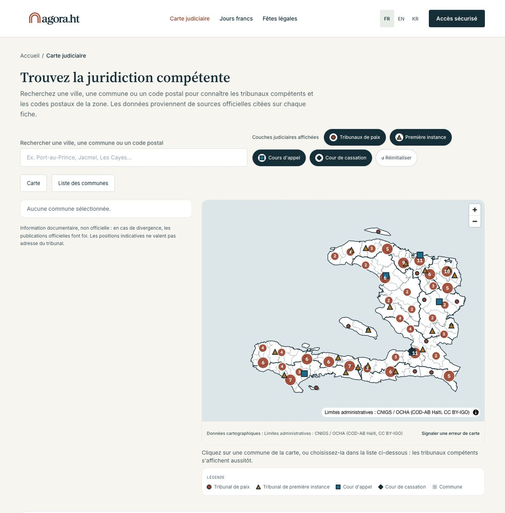
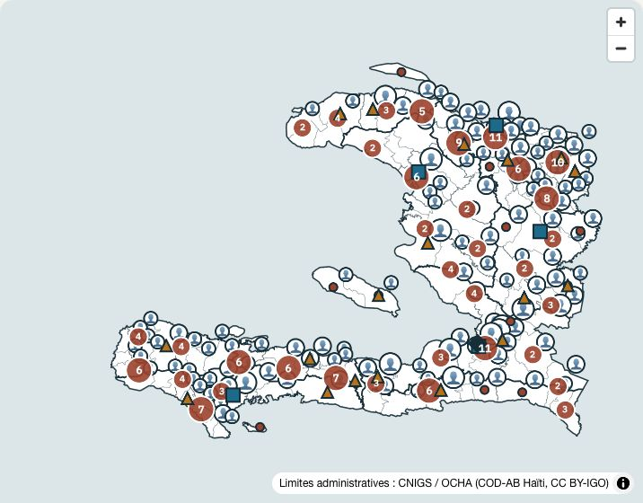
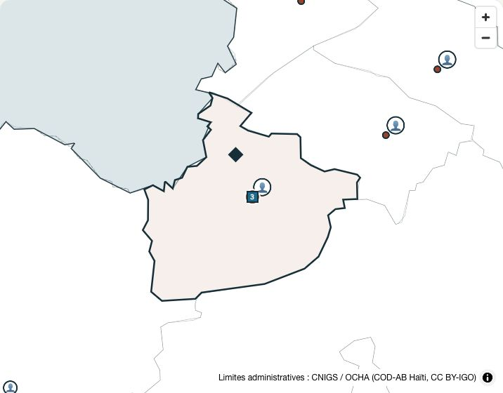
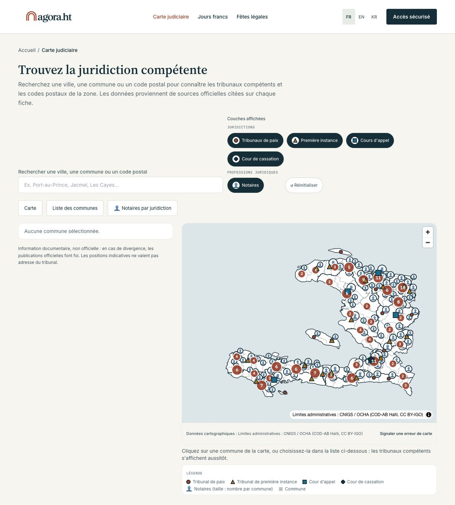
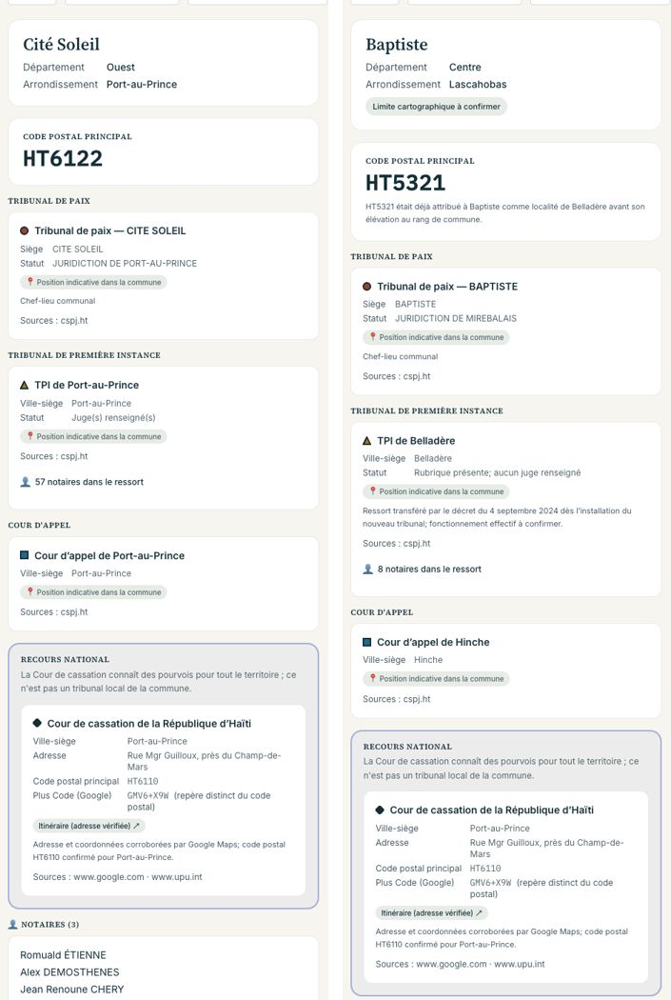
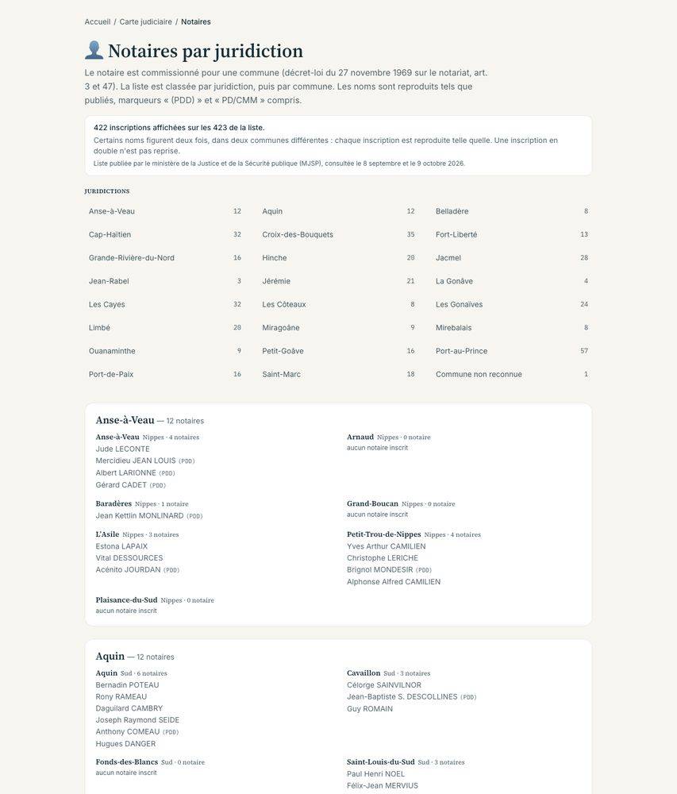
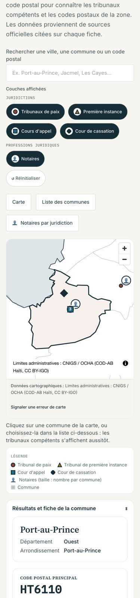
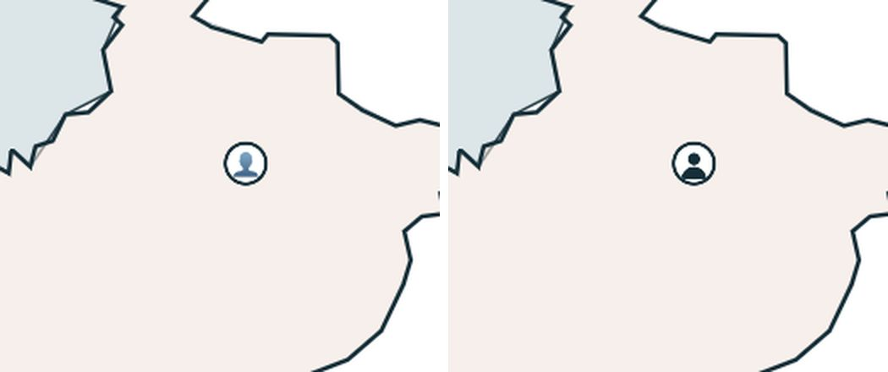

# Livraison — couches au choix et notaires sur la carte judiciaire

9 octobre 2026. Spécification : `docs/prompt-notaires-et-couches-carte-judiciaire.md`.
Code et tests **livrés en local** ; rien n'est poussé ni déployé ; **la production n'a reçu
aucune écriture** (la table `Notary` n'y existe pas encore — voir « Ce qui reste à décider »).

## Ce qui est fait

| chantier | commit | contenu |
|---|---|---|
| A — registre des couches | `234f6af` | `src/lib/jurisdictions/layers.ts` remplace les 7 endroits câblés ; contrat d'URL ; marqueur `emoji` générique ; rendu par défaut inchangé |
| B — notaires | commit « Carte judiciaire : couche notaires (chantier B) », juste après `234f6af` | modèle `Notary`, amorçage + extraction + import (simulation par défaut), route de points, 👤 sur canvas, section « Notaires (N) » de la fiche, ligne du TPI, page `/{locale}/juridictions/notaires`, fr/en/ht |

Ajouter la couche « notaires » au registre n'a demandé **aucune modification** du code du
chantier A, à une exception près, voulue : un champ générique `drawOrder` (plan d'empilement)
ajouté au registre — voir « Décidé seul », point 1.

Vérifications : `npm run typecheck` ✓ · `npm run lint` ✓ (4 avertissements `` antérieurs,
hors périmètre) · `npx vitest run --dir src` ✓ **1 540 tests** · `npm run build:check` ✓ (la
page notaires est rendue à la demande, rien n'est figé au build).

## Chantier A : preuve d'iso-fonctionnalité

Mesurée sur le serveur de développement avant puis après le chantier A (même base) :

- **HTML serveur identique à l'octet** pour `/fr/juridictions`, `?layers=xyz` et la fiche de
  Port-au-Prince : mêmes quatre boutons, mêmes liens, même légende ;
- **mêmes étiquettes d'agrégat à l'ouverture** : 35 sur ordinateur, 5 sur mobile, mêmes
  valeurs (`2,4,3,3,2,5,6,10…` / `2,6,40,76,51`) ;
- captures : 0 pixel d'écart (> 16/255) sur ordinateur, 21 sur mobile (anticrénelage).

| | avant | après |
|---|---|---|
| ordinateur |  |  |
| mobile |  |  |

**Écarts voulus par la spécification**, et eux seuls : la légende ne montre que les couches
affichées (`?layers=paix,tpi` n'en garde que deux) ; `?layers=` (vide) et le décochage de la
dernière couche donnent une carte vide au lieu de « toutes » ; l'ordre écrit dans l'URL est
canonique (`?layers=tpi,paix` produit les mêmes liens que `paix,tpi`) ; la borne passe de 60 à
80 caractères. Aucun test antérieur n'a changé d'attente. Les tests de rendu des boutons écrits
au chantier A ont été mis à jour une fois, au chantier B (5ᵉ bouton, intitulés de groupe) : les
quatre liens des juridictions n'y ont pas bougé.

## Chantier B : les notaires

Vérifié sur une **base locale** (`lam_banc`, référentiel de la carte importé depuis
`seed-v1.json`, notaires importés par le script livré) :

- import : 423 créations ; second passage **0 création, 0 modification, 423 inchangées** ;
  `--apply` **refusé** tant que la table n'a pas la sécurité par ligne ; audit `JUDICIAL_IMPORT`
  tracé et recompté ;
- route : **125 points, total 421**, propriétés `communeId`, `communeName`, `count` seulement ;
- liste textuelle : **422 inscriptions affichées sur 423**, 23 juridictions, Petit-Bourg sous
  « Commune non reconnue », 33 désaccords signalés, 24 communes « aucun notaire inscrit » ;
- fiches : Gonaïves **14, département Artibonite** ; Tiburon **2, département Sud** ;
  Port-au-Prince **21** ; Cité Soleil **3** ; TPI de Port-au-Prince « **57 notaires dans le
  ressort** » ; Baptiste : « Aucun notaire inscrit dans cette commune sur la liste du MJSP » ;
- fr / en / ht vérifiés (fiche, provenance, filtres) ; mobile : groupes empilés, aucun
  défilement horizontal.

| | |
|---|---|
|  |  |
| les cinq couches : les tribunaux restent AU-DESSUS des 👤 | Port-au-Prince : le 👤 (21) en haut à droite, aucun tribunal masqué |







**Le 👤 selon le système.** Capture faite sur Mac (Apple Color Emoji, buste gris-bleu) ; à
droite, le **repli** forcé (rendu de l'emoji supprimé, comme sur un système sans police
emoji) : silhouette tête-épaules en encre. Je n'ai ni Windows ni Android sous la main :
captures à faire sur ces appareils une fois en ligne.



### Totaux par TPI — recomptés sur la base de PRODUCTION

Simulation de l'import contre la production (lecture seule, 9 oct. 2026) : les rattachements
de production **coïncident exactement** avec l'amorçage ; les 23 totaux de la spécification
tombent juste, aucun constat bloquant.

| TPI | notaires | communes | | TPI | notaires | communes |
|---|---|---|---|---|---|---|
| Port-au-Prince | 57 | 9 | | Petit-Goâve | 16 | 3 |
| Croix-des-Bouquets | 35 | 6 | | Grande-Rivière-du-Nord | 16 | 7 |
| Cap-Haïtien | 32 | 6 | | Port-de-Paix | 16 | 4 |
| Cayes | 32 | 8 | | Fort-Liberté | 13 | 6 |
| Jacmel | 28 | 8 | | Aquin | 12 | 3 |
| Gonaïves | 24 | 6 | | Anse-à-Veau | 12 | 4 |
| Jérémie | 21 | 11 | | Miragoâne | 9 | 4 |
| Limbé | 20 | 6 | | Ouanaminthe | 9 | 5 |
| Hinche | 20 | 6 | | Côteaux | 8 | 6 |
| Saint-Marc | 18 | 7 | | Mirebalais | 8 | 3 |
| | | | | Belladère | 8 | 3 |
| | | | | La Gonâve | 4 | 2 |
| | | | | Jean-Rabel | 3 | 2 |

Par cour d'appel : Port-au-Prince 140, Cayes 94, Cap-Haïtien 90, Gonaïves 61, Hinche 36.
Tailles du 👤 : 59 communes à 1-2, 53 à 3-6, 13 à 7 et plus.

### Les 33 désaccords de département (la carte place selon le référentiel)

| imprimé → référentiel | communes (entrées) | n° |
|---|---|---|
| Nippes → Artibonite (23) | Les Gonaïves 14, Saint-Michel-de-l'Attalaye 3, Gros-Morne 3, Marmelade 2, Ennery 1 | 338-360 |
| Sud-Est → Sud (8) | Tiburon 2, Roche-à-Bateau 2, Les Anglais 1, Port-à-Piment 1, Chardonnières 1, Les Côteaux 1 | 256-263 |
| Grand'Anse → Artibonite (1) | L'Estère | 361 |
| Sud → Artibonite (1) | La Chapelle | 215 |

Le détail ligne à ligne est dans le rapport de l'import (`--rapport fichier.md`).

### Les doublons (rien n'est fusionné)

| n° | nom | communes |
|---|---|---|
| 21 / 37 | Gilbert Emile GIORDANI | Port-au-Prince / Cité Soleil — **n° 37 retiré** (décision du 8 sept.) |
| 45 / 91 | Jean Rico AUGUSTIN | Tabarre / Cornillon |
| 48 / 81 | Emmanuel LEBRUN | Carrefour / Thomazeau |
| 102 / 111 | Myriam Fabien SEIDE | Petit-Goâve / Léogâne |
| 140 / 164 | Armand ZEPHIRIN / ZÉPHIRIN | Limbé / Bas-Limbé |
| 142 / 338 | Jacques VINCENT / « Jacques VINCENT PD/CMM » | Milot / Gonaïves |
| 103 / 107 | Daniel Georges Carlet / Daniel G. C. DURANDISSE (abrégé) | Petit-Goâve / Léogâne |

## Les huit questions — défauts APPLIQUÉS, à confirmer

| # | question | défaut appliqué |
|---|---|---|
| 1 | Sens de « (PDD) » (107 noms + 4 débordements dans la colonne Commune) et de « PD/CMM » (n° 338) | affiché tel qu'imprimé après le nom, jamais interprété |
| 2 | Les cinq doubles ouverts et la paire DURANDISSE | toutes les entrées gardées, rien fusionné |
| 3 | Couche notaires visible par défaut ? | **non** : les quatre juridictions restent le défaut |
| 4 | Repli sans emoji : silhouette en encre (capture ci-dessus) | silhouette tête-épaules |
| 5 | Libellé du groupe « Professions juridiques » (en : *Legal professions*, ht : *Pwofesyon jiridik*), et « Juridictions / Jurisdictions / Jiridiksyon » | ceux-là |
| 6 | Petit-Bourg-de-Port-Margot (n° 154) : rattacher à Port-Margot ? | non, sans source citée — « Commune non reconnue » |
| 7 | Le chiffre sur le marqueur ? | non en v1 (taille + fiche + liste) |
| 8 | Comparer à l'effectif légal de l'art. 3 ? | hors périmètre |

À valider aussi : l'intitulé générique des filtres (« Couches affichées », *Displayed layers*,
« Kouch ki parèt yo ») et **tous les libellés créoles neufs** (« Notè yo », « … notè nan
jiridiksyon tribinal la », la ligne de provenance « Lis Ministè Lajistis ak Sekirite Piblik
(MJSP) pibliye, nou konsilte l … », etc.) — écrits sur le vocabulaire déjà présent dans
`ht.ts`, non relus par un locuteur.

## Décidé seul (à relire)

1. **Le 👤 est peint SOUS les tribunaux** (`drawOrder: -1`) et décalé de **14 px** (et non
   10) en haut à droite. À l'échelle du pays, les 125 pastilles de communes voisines
   recouvraient des tribunaux ; à Port-au-Prince, à 10 px, la grande pastille restait presque
   entièrement cachée sous le carré de la cour d'appel. Un clic sur des marqueurs superposés
   sélectionne celui qu'on voit au-dessus.
2. **Provenance publique en clair** : « Liste publiée par le ministère de la Justice et de la
   Sécurité publique (MJSP), consultée le 8 septembre et le 9 octobre 2026. » Dates tirées de
   `sourceJson`, mises en forme dans les trois langues. URL, fichiers et empreintes restent en
   base et dans `scripts/data/notaires-mjsp/EMPREINTES.txt`.
3. La page publique annonce « 422 inscriptions affichées sur les 423 » et dit qu'« une
   inscription en double n'est pas reprise » — **sans nommer** le notaire concerné.
4. La liste par juridiction montre **toutes** les communes de chaque ressort, y compris celles
   sans notaire ; les juridictions sont classées par ordre alphabétique de leur nom.
5. Les intitulés de groupe n'apparaissent que lorsqu'au moins deux groupes ont des couches
   (sinon une rangée unique, comme avant) — c'est ce qui rend le chantier A iso-fonctionnel.
6. La fiche publique ne montre pas l'`observation` interne d'un notaire (désaccords, alias,
   coquilles) ; seule la liste par juridiction signale discrètement le département imprimé
   quand il diffère.
7. L'API `communes/[id]` porte désormais la liste nominative de la commune (même contenu que la
   fiche publique) ; les points de carte, eux, n'ont aucun nom.

## Ce qui reste à décider — rien n'a été écrit en production

État de la production (lecture seule, 9 oct.) : **475 Mo** utilisés (la table `Notary` pèsera
moins de 1 Mo) ; table `Notary` absente ; **20 tables sans sécurité par ligne** (l'audit du
8 sept. en comptait 18 ; `Court` et `JudicialCommune` en font partie).

Tant que la table n'existe pas, le code se dégrade proprement : la route renvoie 503, la fiche
n'a pas de section notaires, la page dit « La liste des notaires n'est pas encore disponible »,
le bouton « Notaires » affiche une carte sans 👤. **Il vaut donc mieux migrer et importer avant
de déployer.** Sur instruction de Me Vaval seulement :

```bash
npx prisma db push                          # crée la table Notary (additif, jamais --force-reset)
npm run db:rls                              # RLS sur toutes les tables — corrige aussi les 20 autres
# (ou, pour ne toucher que la nouvelle table : ALTER TABLE "public"."Notary" ENABLE ROW LEVEL SECURITY;)
npx tsx scripts/import-notaires-mjsp.ts     # simulation : doit afficher 423 créations, 0 anomalie
npx tsx scripts/import-notaires-mjsp.ts --apply
```

Puis `git push` et déploiement. Avant l'import, revérifier que la page du MJSP annonce
toujours « 423 notaires trouvés ».

## Après livraison — décision de la cliente (9 octobre 2026)

**Les notaires ne dépendent pas des tribunaux de première instance.** Dans la liste
« Notaires par juridiction », les juridictions s'affichent donc **sans « TPI »**
(« Port-au-Prince », « Les Cayes », « La Gonâve »…), le sommaire s'intitule « Juridictions »
et l'introduction ne rattache plus le notaire à un tribunal : elle dit seulement qu'il est
commissionné pour une commune (décret-loi de 1969, art. 3 et 47). Le regroupement par ressort
est inchangé. Le nom vient du tribunal sans « TPI » ni préposition, et non de son siège : le
ressort de La Gonâve siège à Anse-à-Galets (`nomJuridiction`, testé sur les 23).

**Reste à trancher** : la fiche d'une commune affiche toujours, sur la carte du TPI, la ligne
« 👤 N notaires dans le ressort ». Faut-il la retirer, ou la déplacer dans la section
« Notaires (N) » (« N notaires dans la juridiction de … ») ?

